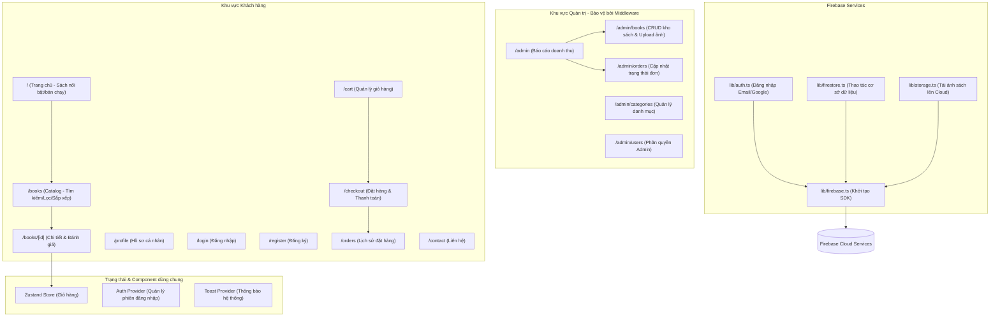

# Website Thương Mại Điện Tử Bán Sách Trực Tuyến (BookStore)

Đây là khung sườn (scaffold) hoàn chỉnh cho dự án môn học Thương mại điện tử: **"Xây dựng website thương mại điện tử bán sách trực tuyến"** sử dụng Next.js (App Router), React, TypeScript, Tailwind CSS, Zustand, và Firebase.

## 1. Công nghệ sử dụng
- **Frontend**: Next.js 14+ (App Router), React, TypeScript, Tailwind CSS.
- **State Management**: Zustand (Giỏ hàng tự động đồng bộ hóa với LocalStorage).
- **Backend**: Firebase SDK (Authentication, Cloud Firestore, Storage) tích hợp sẵn mock-fallback giúp chạy ngay lập tức mà không cần cấu hình.
- **Icons**: Lucide React.

---

## 2. Kiến trúc & Sơ đồ luồng (Code Graph)



---

## 3. Cấu trúc thư mục dự án
```text
src/
 ├── app/                  # Next.js App Router (Client & Admin Pages)
 │    ├── (client)/        # Route group cho khách hàng
 │    ├── (admin)/         # Route group cho trang quản lý admin
 │    ├── globals.css      # Custom styles & animations
 │    ├── layout.tsx       # Root layout
 │    └── middleware.ts    # Bảo vệ các route admin/private
 ├── components/           # Các component dùng chung (Header, BookCard, Toast, Modal...)
 ├── context/              # React Context (AuthContext)
 ├── lib/                  # Khởi tạo Firebase SDK & Base Service
 ├── services/             # Lớp nghiệp vụ (BookService, OrderService, UserService, ReviewService)
 ├── store/                # Zustand State (CartStore)
 └── types/                # TypeScript Interfaces cho dữ liệu
```

---

## 4. Hướng dẫn chạy dự án

### Bước 1: Cài đặt thư viện
Chạy lệnh sau tại thư mục gốc để cài đặt tất cả các phụ thuộc:
```bash
npm install
```

### Bước 2: Cấu hình Firebase (Tùy chọn)
Nhân bản file `.env.local.example` thành `.env.local`:
```bash
cp .env.local.example .env.local
```
Điền các khóa API Firebase của bạn vào file `.env.local`. 
*Lưu ý: Nếu không cấu hình, ứng dụng sẽ tự động chuyển sang chế độ **Local Mock Storage**, cho phép bạn trải nghiệm đầy đủ tất cả các tính năng (đăng nhập, mua hàng, đánh giá, quản trị) trực tiếp trên trình duyệt mà không cần kết nối Internet.*

### Bước 3: Chạy chế độ phát triển
Chạy lệnh sau để khởi động dự án ở cổng `http://localhost:3000`:
```bash
npm run dev
```

---

## 5. Hướng dẫn tài khoản thử nghiệm nhanh (Mock Mode)
Khi chạy ở chế độ Local Mock Storage:
1. **Đăng nhập**: Nhập email bất kỳ và mật khẩu bất kỳ để đăng nhập hoặc tự tạo tài khoản.
2. **Quyền Admin**: Mọi email đăng nhập có chứa từ khóa **`admin`** (ví dụ: `admin@gmail.com`) hoặc đuôi `@bookstore.com` sẽ được tự động phân quyền làm **Quản Trị Viên (role="admin")** và truy cập được vào `/admin`.
3. **Thanh toán trực tuyến**: Khi thanh toán trực tuyến, hệ thống sẽ thực hiện quy trình giả lập chuyển khoản ngân hàng trực quan.
4. **Seed dữ liệu**: 6 cuốn sách kinh điển và 5 danh mục ban đầu đã được cấu hình tự động nạp vào bộ nhớ để hiển thị giao diện đẹp mắt ngay lần đầu tải trang.
